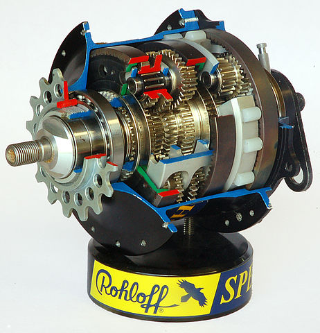

# Functions: return values v.s. side-effects

Well done on writing your first function! It was probably tricky. 

Today's lesson is composed of three parts and a challenge. The first part provides technical information about functions. The next two parts address the large topic of what makes code good or bad. If this seems overwhelming or obscure, don't worry - you can come back to it later (or never). Finally, the challenge asks you to apply your practical learning from the first part.

## Functions and return values

When functions were conceived, they were conceived in the image of mathematical functions. The idea was that you could use them as a formula to turn an input into an output in a predictable way. A function which does this and nothing else is called a 'pure' function, and it's something that a lot of programmers, especially 'functional' programmers, strive for. 

Now, I hate to break it to you, but your functions so far have _not_ been pure, because changing the console is considered a side-effect. To make a pure function, you have to take advantage of the built-in method for defining the output of a function by specifying its _return value_. You do this with the return keyword:

```javascript
function squarer(n) {
  return n ** 2;
}
console.log(squarer(5))
```

Here, squarer _returns_ n ** 2, which is then provided as the argument to console.log

After the return statement is executed, the function exits, and no more code is evaluated:

```javascript
function astleyIntercepted() {
  console.log('drum roll...')
  return
  console.log('never gonna break your heart, never gonna let you down')
}
```

If you don't give a specific value to return, the function returns ```undefined```, a primitive value in JavaScript. 

Note that _every_ function returns _something_. if there is no return statement to specify a custom return value, the function returns ```undefined```.

Let's call 

```javascript
console.log(console.log('hello, world'))
```

The inner console.log logs hello, world, but the outer one simply logs undefined, because the inner one has an undefined return value. 

## The functional programmer's dream

Functional programmers would like a system composed entirely of pure functions, which are engineered to work independently of each other and to slot together perfectly. 



(This is the rohloff speedhub, for changing gears on a bicycle - it costs £1000 and comes with a lifetime warranty. The design principle is to make a closed system, in which parts fit together perfectly and are immune to changes from the outside world, in order to minimise the need for maintenance)

A functional program like this is easiest to achieve when you control all the moving parts. If you don't, you have to rely on everyone else playing ball. 

## JavaScript and APIs

In JavaScript, you almost never control all the moving parts.

JavaScript was invented to be embedded into the browser, and to talk to other languages and programs, e.g. by handling web requests and things that go onto a web page. We already did a bit of this when we added event listeners. 

Programs talk to each other via _APIs_, or application programming interfaces. These are nothing more than the parts of a program that are available for other programs to interact with, like the holes in an electrical outlet are the part of a home's electrical system that are available for other devices to interact with. When you make your own programs that can be read by other programs, you'll be making APIs, and possibly without even realising it.

We've already used two APIs, firstly when we changed the content of websites with client-side JavaScript, and secondly when we logged things to the console.

Let's take the DOM API as an example, which is the API we used when we changed the content of websites with JavaScript. The DOM API provides a ```document``` object to JavaScript, so that when you're programming in a browser environment, you can change the properties of the document object, and the DOM will change the actual html document (the website itself). (Note that the document object is not available in repl.it, because repl.it, while representing JavaScript (mostly) accurately, does not try to simulate the programming environment of a browser.)

When we're trying to use an external API to create change, _just returning_ values from our functions isn't going to cut it, because if we're returning values we need to be in control of something to 'catch' those values. Since we're not programming the DOM directly, but from JavaScript, we can't write code from the DOM's perspective which calls our functions and monitors their return value. Instead, we'll have to write some JavaScript that changes the state of an external thing (the DOM): and that's where side-effects come in. 

When you want your code to 'talk' to other programs via their APIs, you will likely not be able to avoid side-effects. On the other hand, when you are writing functions to talk to other functions within your program, you might want to consider function purity as one criterion for code quality.


# Challenge

So, one thing that can make your code high-quality is writing pure functions. Another way to increase code quality is _composition_. Code is _composable_ when complex functions are made out of simple functions. The ideal is to have a higher number of simpler functions, each of which has an informative and useful name, and which can be reused later if you want. Pure functions are useful here too, because you can rely on being able to reuse a function if you know that it is pure.

Take the function you wrote yesterday and refactor it so that
- there is one function that returns a random number in a specified range. You should be able to provide the upper and lower bounds of the range to the function as arguments.
- there is another function which calls the first function, converts the returned number into a letter, and returns that letter
- console.log is not called inside a function, but uses the return value of a function to print results to the console

## Bonus challenge
Only do this if you want to.

Edit the function so that you can give it two _letters_, and it will provide you with a random letter in between those two letters. If you get strange results, don't forget to consult the ASCII table!

hint: String.fromCharCode() has an inverse function